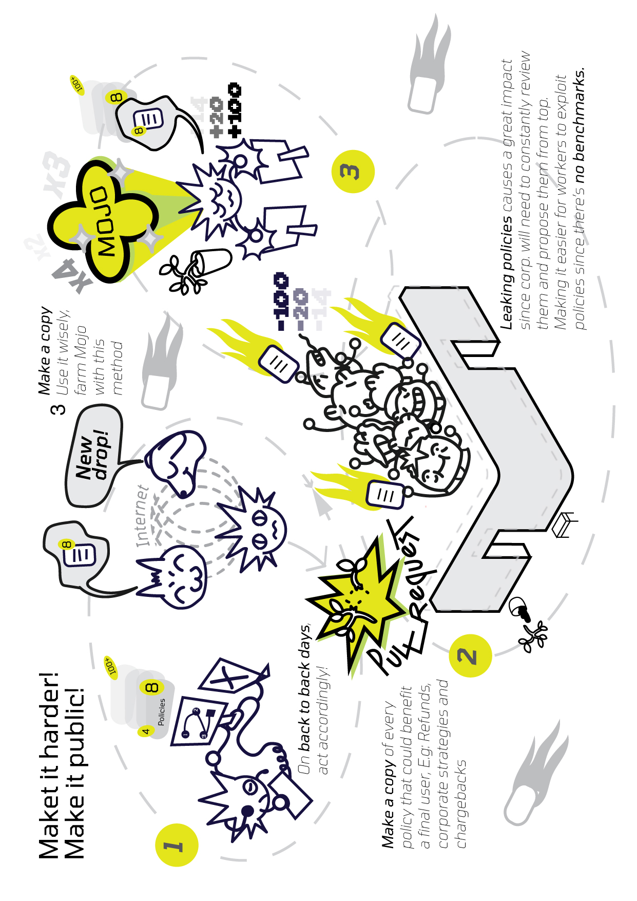
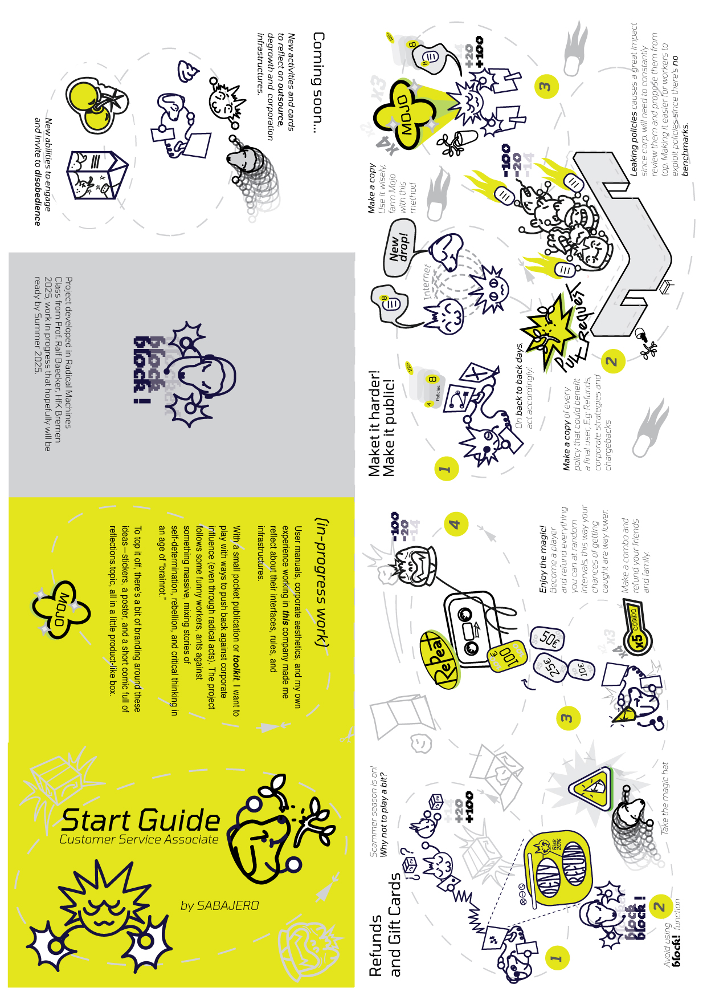

Documentation 

## Project Information    

- Title: How to shit on your company
- Category: Semester Work   
- Student/s: Jerónimo Gutiérrez Balanta  
- Course Title: Radical Machines  
- Lecturer/s: Ralf Baecker   
- Year: Winter Semester 2024

## Description - Text + images + links  

  
*Cover of the zine/publication*

“How to Shit in Your Company” (code name molokit) is a project that critically examines Amazon's outsourcing infrastructures through fictioning, proposing radical ways to attack or reflect on the condition of digital workers. Rooted in my personal experience as an outsourced Customer Service Associate working from Colombia, the project takes the form of a user manual–future kit designed to collectively reflect on contemporary working conditions.

The project is accompanied by an essay that offers a deeper analysis of the infrastructures, systems, and dynamics I experienced at Amazon. I will argue with different theoretical perspectives, that Amazon’s infrastructure goes beyond physical to encompass political, social, technical, economic, and productive hegemonies that shape not only our actions but also our most personal decisions and desires.

I also explore how fictioning and speculative design can function as tools of resistance through this user manual/kit. The project rethinks corporate logic and invites us to imagine alternatives to capitalism. Drawing from retro video game aesthetics, a fascination with user manuals, and my interest in drawing, I created characters, scenarios, and special abilities that playfully aim to ignite disobedience against corporations. The final outcome is envisioned as a game-toolkit, meant to provoke thought and challenge Amazon’s infrastructural power among workers and the people.    

*Closeup of the Kit Package*

  
*First Scenario from Zine, February 2025*
  

*General Overlay Zine, Side A, February 2025*
  

[Full pdf essay](jgb_molokit_essay.pdf)
Full Essay in PDF

[Full essay](https://sites.google.com/view/jeronimo-gutierrezbalanta/projects/outsourcing-infrastructures?authuser=0) (In my portfolio page as an entry) 

[Git Hub](https://github.com/sabajero/How-to-shit-on-your-Company) (Markdown Repository)

[Google Drive](https://drive.google.com/drive/folders/1vbRG0gsNpRj_I-hHsAeHaMMErPGxC_Ss?usp=drive_link) (Access on request)

Special Thanks to Indrayuth Sengupta and Tim Reidlich for their manual labor

## References 

Kroth, L. (2022). Infrastructure, translation, and metaphor. In Broken relations: Infrastructure, aesthetics, and critique,Spector Books.​

Srnicek, N., & Williams, A. (2016). Inventing the future: Postcapitalism and a world without work. Verso Books.​

Gramelsberger, (2024) Infrastruktur Theorien: Begriff und Geschichte. 

Fisher, M. (2009). Capitalist realism: Is there no alternative? Zero Books.​

Haiven, M. (2024). Amazon and alienation. In M. Haiven & A. Priebe (Eds.), The world after Amazon
 
Srnicek, N., & Williams, A. (2016). Inventing the future: Postcapitalism and a world without work. Verso Books.​

Mason, P. (2012). Why it's kicking off everywhere: The new global revolutions. Verso.​

Pollman, E. (2019). Corporate disobedience. Duke Law Journal, https://www.jstor.org/stable/48563663

  
*Character Molo*

